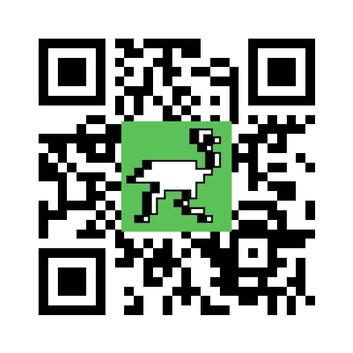

# Qrlogo

[](https://github.com/delivery-club/qrlogo/blob/master/.github/workflows/ci.yml)
[](https://goreportcard.com/report/github.com/delivery-club/qrlogo)
[](https://pkg.go.dev/github.com/delivery-club/qrlogo)

## Intro

QRLogo is a small library and command line to generate QR images with small logo placed in the center.

Thanks to redundancy in the QE codes nature, code remains readable even if part of its covered by image, i.e. logo. It
allows to create nice branded-like QR codes.



## Install

To install command line tool:

```go get github.com/delivery-club/cmd/qrlogo```

Or only lib (basically, the same, but without installing binary):

```go get github.com/delivery-club/qrlogo```

## Usage

### Command line tool

For command line tool, it's enough to specify input image (i.e. logo) and text or URL to be encoded:

```qrlogo -i logo.jpeg https://delivery-club.ru```

Output will be written to qr.png file in PNG format by default but also supports: jpeg.

You can also specify output filename and image size (512px by default). See `-help` output for details.

Note, that resizing logo image is up to you, it will be placed on top of resulting QR code without resizing or guessing
proportions.

### Library

For the library, usually it's enough to call only `qrlogo.Encode()` function.
See [Documentation](https://godoc.org/github.com/delivery-club/qrlogo) for more details
or [test examples](https://github.com/delivery-club/qrlogo/blob/master/qr_test.go).

Supported picture formats (in/out):

- png
- jpeg
- jpg

## License

MIT
